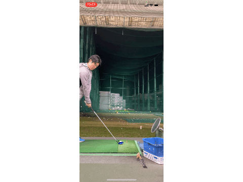

#  【Swift】Vision Frameworkで動画からボールの軌道検出するアプリを作りました

## はじめに
撮影している動画に対して、リアルタイムでボールの軌道を特定し、動画に軌道を重ね合わせるアプリを作成しました（下記のgifは作成したアプリでゴルフボールの軌道を検出したデモです） 。  
SwiftのコンピュータビジョンフレームワークVsion Framework関係、特に軌道検出についての情報がほとんどネットに無かったので、記事を書きました。  
私自身もVision Frameworkを使い始めたばかりなので、アドバイスをいただけると幸いです。  
ソースコードは[こちら]()になります。  

## 利用用途
球技スポーツ（ゴルフ、野球、サッカー等）のボールの軌道検出のため  
iOS14以降でのiPhone/iPadに対応

## 対象者
SwiftのVsion Frameworkの中にある軌道検出クラスVNDetectTrajectoriesRequestを用いてアプリ開発をしたい人  

## 実装方法
### 開発環境
  - XCode 12.2
  - Swift 5
### 使用フレームワーク
  1. UIKit
  1. Vision
  1. AVFoundation

### 軌道検出に関係するクラスの説明
1. VNDetectTrajectoriesRequest
    - インスタンスを生成する際に、引数で下記を与えます
    - frameAnalysisSpacing: CMTime
        - 軌道の分析の時間間隔を設定します
        - この値を大きくすると、分析にかけるフレームを間引くことができ、スペックの低いデバイスで有効だそうです
        - .zeroに設定すると全てのフレームを分析にかけることができます（今回は.zeroにしました）
    - trajectoryLength: Int
        - 軌道に乗っている点に必要な数です
        - 最低は5点ですが、点数が少ないとたくさんの軌道を誤認識してしまいます（個人的には、10点くらいにするとちょうど良くゴルフボールを捉えることができました）
     - completionHandler: VNRequestCompletionHandler?
        - 検出が完了した際に呼ばれるクロージャです　※今回、completionHandlerというメソッドを作成し、それが呼ばれるようにしました
    - プロパティ
     - objectMaximumNormalizedRadius: Float　※今回、設定値が反映されなかったので、機能していないように思います
       - トラッキングしたいモノ（ボール）の半径の最大を設定します
       - セットすることにより、大きな動くモノをフィルタにかけることができます
       - 設定範囲は、フレームのサイズを正規化した[0.0, 1.0]で、デフォルトが1.0になっています
       - 同様のプロパティmaximumObjectSizeは非推奨になりました
    - objectMinimumNormalizedRadius: Float　※今回、設定値が反映されなかったので、機能していないように思います
      - トラッキングしたいモノ（ボール）の半径の最小を設定します
      - セットすることにより、ノイズや小さな動くモノをフィルタにかけることができます
      - 設定範囲は、フレームのサイズを正規化した[0.0, 1.0]で、デフォルトが0.0になっています
      - 同様のプロパティminimumObjectSizeは非推奨になりました
    - regionOfInterest: CGRect（今回、設定値が反映されなかったので、機能していないように思います）
      - 軌道検出をする範囲を設定します
      - 設定範囲は、フレームのサイズを正規化した[0.0, 1.0]で、CGRectで原点と幅、高さを設定をします
    - results: [VNTrajectoryObservation]?
      - 軌道検出が完了した際に結果として返される変数です
1. VNTrajectoryObservation
      - detectedPoints
        - 
      - projectedPoints
        - 
      - equationCoefficients
      - uuid
        - 各軌道でユニークなIDが与えられます
        - ex) 
      - timeRange
      - confidence
        - 軌道の信頼度が与えられます
        - ほとんどの場合で0.9を超えています
        - ex) 

[Identifying Trajectories in Video | Apple Developer Documentation](https://developer.apple.com/documentation/vision/identifying_trajectories_in_video)より引用しました
  
  

### 実装のポイント

## 参考文献
- [Building a Feature-Rich App for Sports Analysis | Apple Developer Documentation](https://developer.apple.com/documentation/vision/building_a_feature-rich_app_for_sports_analysis)
- [Identifying Trajectories in Video | Apple Developer Documentation](https://developer.apple.com/documentation/vision/identifying_trajectories_in_video)
- [Setting Up a Capture Session | Apple Developer Documentation](https://developer.apple.com/documentation/avfoundation/cameras_and_media_capture/setting_up_a_capture_session)

