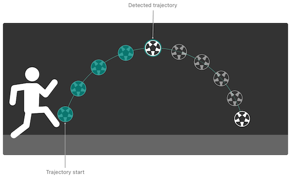
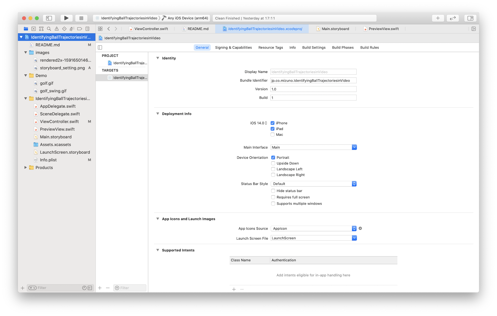
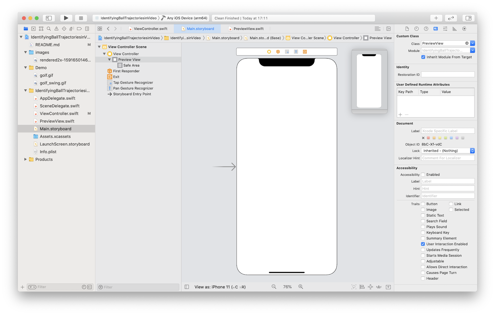

#  【Swift】Visionフレームワークを用いた動画からリアルタイムにボールの軌道を検出するアプリ

## はじめに
撮影している動画に対して、リアルタイムでボールの軌道を検出し、動画に軌道を重ね合わせるアプリを作成しました（下記のgifは作成したアプリでゴルフボールの軌道を検出したデモです） 。  
画像処理を目的とした[Visionフレームワーク（顔検出、文字検出、バーコード検出、...）](https://developer.apple.com/documentation/vision)の中の１つの機能として、軌道検出がiOS14から使用できるようになりました。
しかし、Vsionフレームワーク関係、特に軌道検出についての情報がほとんどネットに無かったので、記事を書きました。  
私自身もVisionフレームワークを使い始めたばかりなので、アドバイスをいただけると幸いです。  
ソースコードは[こちら](https://github.com/MIZUNO-CORPORATION/IdentifyingBallTrajectoriesinVideo)になります。  


## 利用用途
球技スポーツ（ゴルフ、野球、サッカー等）のボールの軌道検出のため  
iOS14以降でのiPhone/iPadに対応


## 軌道検出の流れ
軌道検出をするには「リクエスト」と「リクエストハンドラ」、「オブザベーション」を使います。
1. リクエストで、Visionフレームワーク中の使用したい機能とパラメタを設定します（今回は、軌道検出機能の `VNDetectTrajectoriesRequest` を使用）
1. リクエストハンドラに、処理したい画像と設定したリクエストを渡すことで検出処理が行われます
1. オブザベーションで、検出結果が取得できます（今回は、軌道検出用途の `VNTrajectoryObservation` で取得）

## 軌道検出で取得できる情報
オブザベーションから下記のような情報が取得できます。
1. `detectedPoints`（gifの赤色の線）
   - 検出された軌道の座標：リクエストで設定したフレーム数過去に遡り、フレーム数分の軌道の[0,1.0]に正規化されたx,y座標が取得される
   - `[VNPoint]`  ：画像におけるx,y座標の配列
   - アウトプット例：[[0.027778; 0.801562], [0.073618; 0.749221], [0.101400; 0.752338], [0.113900; 0.766406], [0.119444; 0.767187], [0.122233; 0.774219], [0.130556; 0.789063], [0.136111; 0.789063], [0.144444; 0.801562], [0.159733; 0.837897]]
1. `projectedPoints`（gifの緑色の線）
   - 予測された軌道の座標：過去の5フレーム分遡り、5点分の2次方程式に変換された軌道の[0,1.0]に正規化されたx,y座標が取得される
   - `[VNPoint]`：画像におけるx,y座標の配列
   - アウトプット例：[[0.122233; 0.771996], [0.130556; 0.782801], [0.136111; 0.791214], [0.144444; 0.805637], [0.159733; 0.837722]]
1. `equationCoefficients`
   - 予測された軌道の2次方程式：projectedPointで変換された軌道の2次方程式が取得される
   - `simd_float3`：2次方程式の係数
   - アウトプット例：SIMD3<Float>(15.573865, -2.6386108, 0.86183345)
1. `uuid`
    - 軌道のID：各軌道でIDが与えられる。次のフレームで検出した軌道が前のフレームで検出した軌道に含まれると判定された場合は、同じIDが与えられる
    - `UUID`：一意のID
    - アウトプット例：E5256430-439E-4B0F-91B0-9DA6D65C22EE
1. `timeRange`
    - 軌道のタイムスタンプ：各軌道の検出されたタイミングが取得される
    - `CMTimeRange`：検出された時（Trajectory start）のタイムスタンプと検出され続けた（Detected trajectoryまでの）期間
    - アウトプット例：{{157245729991291/1000000000 = 157245.730}, {699938542/1000000000 = 0.700}}
1. `confidence`
    - 軌道の信頼度：[0,1.0]に正規化された検出された軌道の信頼度
    - `VNConfidence`：観測物の精度の信頼水準
    - アウトプット例：0.989471
    

[Identifying Trajectories in Video | Apple Developer Documentation](https://developer.apple.com/documentation/vision/identifying_trajectories_in_video)より引用しました


## 実装方法
### 開発環境
  - XCode 12.2
  - Swift 5
### 使用フレームワーク
  1. UIKit
  1. Vision
  1. AVFoundation

### 軌道検出に関係する実装の説明
#### デバイスの向きの設定
今回の実装だと`Landscape`等にすると動画の再生画面が90度回転してしまうため、`Portrait`に設定をしています。  


#### 動画を再生・描画するViewの作成
今回、`AVCaptureVideoPreviewLayer`を使用し、このレイヤーは入力デバイスによってキャプチャされたビデオを表示するために使用する`CALayer`のサブクラスです。  
このレイヤーをキャプチャセッションと組み合わせて使用します。
```swift: PreviewView.swift
import UIKit
import AVFoundation

class PreviewView: UIView {
    override class var layerClass: AnyClass {
        return AVCaptureVideoPreviewLayer.self
        
    }
        
    var videoPreviewLayer: AVCaptureVideoPreviewLayer {
        return layer as! AVCaptureVideoPreviewLayer
    }
}
```
#### Storyboardとの連携
デフォルトのViewController.swiftと紐づいたシーン中のViewに作成したPreviewView.swiftを紐付けます。


#### 使用するフレームワーク
```swift: ViewController.swift
import UIKit
import AVFoundation
import Vision
```

#### リクエストの宣言
軌道を検出するため`VNDetectTrajectoriesRequest`を宣言し、引数は下記３つになります。  
1. `frameAnalysisSpacing: CMTime`
    - 軌道の分析の時間間隔を設定する
    - この値を大きくすると、分析にかけるフレームを間引くことができ、スペックの低いデバイスで有効になる
`.zero`に設定すると全てのフレームを分析にかけることができるが負荷は大きくなる（今回は.zeroにしました）  
  
1. `trajectoryLength: Int`
    - 軌道に乗っている点に必要な数
    - 最低は5点だが、点数が少ないとたくさんの軌道を誤認識してまう（個人的には、10点くらいにするとちょうど良くゴルフボールを捉えることができました）  
  
1. `completionHandler: VNRequestCompletionHandler?`
    - 検出が完了した際に呼ばれるクロージャ　※今回、completionHandlerというメソッドを作成し、それが呼ばれるようにしました  
  
```swift: ViewController.swift
var request: VNDetectTrajectoriesRequest = VNDetectTrajectoriesRequest(frameAnalysisSpacing: .zero, trajectoryLength: 10, completionHandler: completionHandler)
```
#### リクエストのプロパティの設定
リクエストのプロパティには下記の３つが用意されており、必要に応じて設定できます。
1. `objectMaximumNormalizedRadius: Float`　※今回、設定値が反映されなかったので、機能していないように思います
   - トラッキングしたいモノ（ボール）の半径の最大を設定する
   - セットすることにより、大きな動くモノをフィルタにかけることができる
   - 設定範囲は、フレームのサイズを正規化した[0.0, 1.0]で、デフォルトが1.0になっている
   - 同様のプロパティmaximumObjectSizeは非推奨になっている
1. `objectMinimumNormalizedRadius: Float`
    - トラッキングしたいモノ（ボール）の半径の最小を設定する
    - セットすることにより、ノイズや小さな動くモノをフィルタにかけることができる
    - 設定範囲は、フレームのサイズを正規化した[0.0, 1.0]で、デフォルトが0.0になっている
    - 同様のプロパティminimumObjectSizeは非推奨になっている
1. `regionOfInterest: CGRect`　※gifの青色の線が設定範囲になります
    - 軌道検出をする範囲を設定する
    - 設定範囲は、フレームのサイズを正規化した[0.0, 1.0]で、CGRectで原点と幅、高さを設定をし、デファルトは`CGRect(x: 0, y: 0, width: 0.5, height: 1.0)`になっている

```swift: ViewController.swift
request.objectMaximumNormalizedRadius = 0.5
request.objectMinimumNormalizedRadius = 0.1
request.regionOfInterest = CGRect(x: 0, y: 0, width: 0.5, height: 1.0)
```

#### リクエストハンドラの設定
`orientation`を`.right`に設定しないと、90度回転した状態でリクエストハンドラに送られ、取得したオブザベーションから軌道の描画をする際に90度回転し直さなければいけなくなります。
```swift: ViewController.swift
func captureOutput(_ output: AVCaptureOutput, didOutput sampleBuffer: CMSampleBuffer, from connection: AVCaptureConnection) {
    do {
        let requestHandler = VNImageRequestHandler(cmSampleBuffer: sampleBuffer, orientation: .right, options: [:])
        try requestHandler.perform([request])
    } catch {
        // Handle the error.
    }
}
```

#### オブザベーションの取得
取得した軌道の座標は、左下が原点のVisionの座標系であるため、左上が原点のUIViewの座標系に変換する必要があります。
```swift: ViewController.swift
func completionHandler(request: VNRequest, error: Error?) {
    if let e = error {
        print(e)
        return
    }
    
    guard let observations = request.results as? [VNTrajectoryObservation] else { return }
    
    for observation in observations {
        // Convert the coordinates of the bottom-left to ones of the upper-left
        let detectedPoints: [CGPoint] = observation.detectedPoints.compactMap {point in
            return CGPoint(x: point.x, y: 1 - point.y)
        }
        let projectedPoints: [CGPoint] = observation.projectedPoints.compactMap { point in
            return CGPoint(x: point.x, y: 1 - point.y)
        }
        let equationCoefficients: simd_float3 = observation.equationCoefficients
        
        let uuid: UUID = observation.uuid
        let timeRange: CMTimeRange = observation.timeRange
        let confidence: VNConfidence = observation.confidence
    }
    
    //Call a method to draw the trajectory
}
```

#### 取得した軌道の座標をUIViewの画角に合わせる
変換した座標は正規化された値のなので、軌道を正しく描画するためにUIViewの画角に変換する必要があります。
```
func convertPointToUIViewCoordinates(normalizedPoint: CGPoint) -> CGPoint {
    // Convert normalized coordinates to UI View's ones
    let convertedX: CGFloat
    let convertedY: CGFloat
    
    if let rect = panGestureRect {
        // If ROI is setting
        convertedX = rect.minX + normalizedPoint.x*rect.width
        convertedY = rect.minY + normalizedPoint.y*rect.height
    }else {
        let videoRect = previewView.videoPreviewLayer.layerRectConverted(fromMetadataOutputRect: CGRect(x: 0.0, y: 0.0, width: 1.0, height: 1.0))
        convertedX = videoRect.origin.x + normalizedPoint.x*videoRect.width
        convertedY = videoRect.origin.y + normalizedPoint.y*videoRect.height
    }
    
    return CGPoint(x: convertedX, y: convertedY)
}
```

## さいごに
軌道検出の実装の流れについては、Visionフレームワークの他の機能と同様なため、理解しやすかったです。
ただ、動画撮影の設定と座標変換は、AVFoundationとUIKitのフレームワークについてもある程度理解しておかなくてはいけなく、実装が大変でした。
下記の参考文献がとても参考になりました。
間違いがありましたら、ご指摘いただけるとありがたいです。


## 参考文献
- [Building a Feature-Rich App for Sports Analysis | Apple Developer Documentation](https://developer.apple.com/documentation/vision/building_a_feature-rich_app_for_sports_analysis)
- [Identifying Trajectories in Video | Apple Developer Documentation](https://developer.apple.com/documentation/vision/identifying_trajectories_in_video)
- [Setting Up a Capture Session | Apple Developer Documentation](https://developer.apple.com/documentation/avfoundation/cameras_and_media_capture/setting_up_a_capture_session)
- [【iOS12対応】Visionを使って顔検出を行う - おもちゃラボ](https://nn-hokuson.hatenablog.com/entry/2019/07/25/212153)
- [【Vision・Core ML・iOS・Swift】リアルタイム映像のオブジェクトを識別する - Qiita](https://qiita.com/chino_tweet/items/da91690ef0143c9e8e9c)


